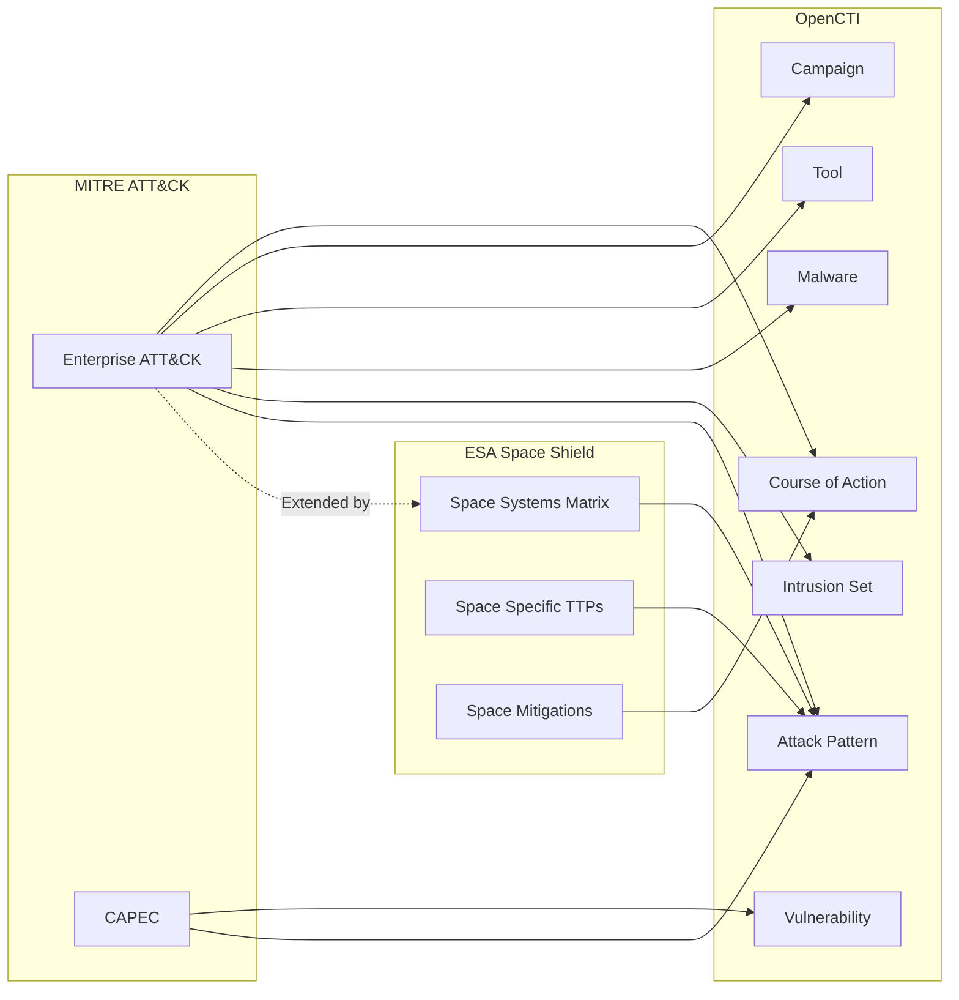

# OpenCTI SPACESHIELD by European Space Agency (ESA) Connector

| Status | Date | Comment |
|--------|------|---------|
| -  | -    | -       |

This connector named SPACESHIELD CONNECTOR imports the complete SPACESHIELD framework inspired by the MITRE ATT&CK dataset into OpenCTI.

## Table of Contents

- [OpenCTI SPACESHIELD Connector](#opencti_connector_spaceshield)
  - [Table of Contents](#table-of-contents)
  - [Introduction](#introduction)
  - [Installation](#installation)
    - [Requirements](#requirements)
  - [Configuration variables](#configuration-variables)
    - [OpenCTI environment variables](#opencti-environment-variables)
    - [Base connector environment variables](#base-connector-environment-variables)
    - [Connector extra parameters environment variables](#connector-extra-parameters-environment-variables)
  - [Deployment](#deployment)
    - [Docker Deployment](#docker-deployment)
    - [Manual Deployment](#manual-deployment)
  - [Usage](#usage)
  - [Behavior](#behavior)
  - [Debugging](#debugging)
  - [Additional information](#additional-information)

## Introduction

The [SPACE-SHIELD](https://spaceshield.esa.int/) (Space Attacks and Countermeasures Engineering Shield) is an ATT&CK® like knowledge-base framework for Space Systems. It is a collection of adversary tactics and techniques, and a security tool applicable in the Space environment to strengthen the security level. It is composed by threats that are relevant for Space systems, leveraging the available and related literature. The Matrix is tailored on the Space Segment and communication links, and it does not address specific types of mission, maintaining a broad and general point of view. 

This connector imports the complete SPACE-SHIELD framework.

All data is imported in native STIX 2.1 format from SPACESHIELD's official site.

## Installation

### Requirements

- OpenCTI Platform >= 6.x
- Internet access to GitHub raw content

## Configuration variables

There are a number of configuration options, which are set either in `docker-compose.yml` (for Docker) or in `config.yml` (for manual deployment).

### OpenCTI environment variables

| Parameter     | config.yml | Docker environment variable | Mandatory | Description                                          |
|---------------|------------|-----------------------------|-----------|------------------------------------------------------|
| OpenCTI URL   | url        | `OPENCTI_URL`               | Yes       | The URL of the OpenCTI platform.                     |
| OpenCTI Token | token      | `OPENCTI_TOKEN`             | Yes       | The default admin token set in the OpenCTI platform. |

### Base connector environment variables

| Parameter         | config.yml      | Docker environment variable   | Default         | Mandatory | Description                                                                 |
|-------------------|-----------------|-------------------------------|-----------------|-----------|-----------------------------------------------------------------------------|
| Connector ID      | id              | `CONNECTOR_ID`                |                 | Yes       | A unique `UUIDv4` identifier for this connector instance.                   |
| Connector Type      | type              | `CONNECTOR_TYPE`                |                 | Yes       | The type of the connector (in this case "EXTERNAL_IMPORT"                   |
| Connector Name    | name            | `CONNECTOR_NAME`              | SpaceShield ESA    | Yes        | Name of the connector.                                                      |
| Connector Scope   | scope           | `CONNECTOR_SCOPE`             | "identity", "attack-pattern", "course-of-action", "x-mitre-tactic", "x-mitre-matrix"           | Yes        | The scope or type of data the connector is importing.                       |
| Log Level         | log_level       | `CONNECTOR_LOG_LEVEL`         | info           | Yes        | Determines the verbosity of the logs: `debug`, `info`, `warn`, or `error`.  |

### Connector extra parameters environment variables

| Parameter                | config.yml                   | Docker environment variable      | Default                                                                              | Mandatory | Description                                                    |
|--------------------------|------------------------------|----------------------------------|--------------------------------------------------------------------------------------|-----------|----------------------------------------------------------------|
| Spaceshield Stix Url | spaceshield.stix_url | `SPACESHIELD_STIX_URL` | https://spaceshield.esa.int/stix/space-attack.json                                                                              | Yes        | The URL for the Knowledge Base.            |
| Spaceshield Confidence Level | spaceshield.confidence_level | `SPACESHIELD_CONFIDENCE_LEVEL` | 75                                                                              | Yes        | The confidence level for the information ingested.            |
| Spaceshield Author Name | spaceshield.author_name | `SPACESHIELD_AUTHOR_NAME` | European Space Agency (ESA)                                                                              | Yes        | The author's name for each entity ingested.            |
| Spaceshield Author Identity Class | spaceshield.author_identity_class | `SPACESHIELD_AUTHOR_IDENTITY_CLASS` | "organization"                                                                              | Yes        | The author's identity class the author.            |

## Deployment

### Docker Deployment

Build the Docker image:

```bash
docker build -t opencti/connector-spaceshield:latest .
```

Configure the connector in `docker-compose.yml`:

```yaml
connector-spaceshield:
  image: ghcr.io/serlabuniba/opencti_connector_spaceshield:latest
    build:
      context: ./connector-spaceshield
    environment:
      - OPENCTI_URL=http://localhost
      - OPENCTI_TOKEN=ChangeMe
      - CONNECTOR_ID=ChangeMe
      - CONNECTOR_TYPE=EXTERNAL_IMPORT
      - CONNECTOR_NAME=SpaceShield ESA
      - CONNECTOR_SCOPE=attack-pattern,course-of-action,x-mitre-tactic,x-mitre-matrix
      - CONNECTOR_LOG_LEVEL=info
      - CONNECTOR_DURATION_PERIOD=P7D
      - CONNECTOR_RESET_STATE_ON_START=false
      - SPACESHIELD_STIX_URL=https://spaceshield.esa.int/stix/space-attack.json
      - SPACESHIELD_CONFIDENCE_LEVEL=75
      - SPACESHIELD_AUTHOR_NAME=European Union Agency (ESA)
      - SPACESHIELD_AUTHOR_IDENTITY_CLASS=organization
    depends_on:
      opencti:
        condition: service_healthy
    restart: always
```

Start the connector:

```bash
docker compose up -d
```

### Manual Deployment

1. Create `config.yml` based on `config.yml.sample`.

2. Install dependencies:

```bash
pip3 install -r requirements.txt
```

3. Start the connector from the `src` directory:

```bash
python3 -m __main__
```

## Usage

The connector runs automatically at the interval defined by `CONNECTOR_DURATION_PERIOD` (7 days).

To force an immediate run:

**Data Management → Ingestion → Connectors**

Find the connector and click the refresh button to reset the state and trigger a new sync.

## Behavior

The connector fetches STIX 2.1 bundles from [SPACE-SHIELD](https://spaceshield.esa.int/) official site and imports them directly into OpenCTI.

### Data Flow



### Entity Mapping

| MITRE Data Type      | OpenCTI Entity      | Description                                      |
|----------------------|---------------------|--------------------------------------------------|
| attack-pattern       | Attack Pattern      | Tactics and techniques                           |
| intrusion-set        | Intrusion Set       | Threat actor groups                              |
| malware              | Malware             | Malware families and samples                     |
| tool                 | Tool                | Legitimate tools used by adversaries             |
| campaign             | Campaign            | Attack campaigns                                 |
| course-of-action     | Course of Action    | Mitigations and defensive measures               |
| x-mitre-tactic       | -                   | Converted to kill chain phases                   |
| x-mitre-matrix       | -                   | ATT&CK matrix metadata                           |
| x-mitre-data-source  | -                   | Data sources for detection                       |

### ATT&CK Matrices Imported

1. **Enterprise ATT&CK**: Windows, macOS, Linux, Cloud, Network, Containers
2. **Mobile ATT&CK**: Android, iOS
3. **ICS ATT&CK**: Industrial Control Systems
4. **CAPEC**: Attack patterns with CWE/CVE relationships

### Processing Details

- **Native STIX Import**: All data is in native STIX 2.1 format
- **Relationships**: All MITRE relationships (uses, mitigates, subtechnique-of) are preserved
- **Kill Chain**: ATT&CK tactics are mapped to kill chain phases
- **External References**: MITRE IDs and documentation links are preserved

## Debugging

Enable verbose logging:

```env
CONNECTOR_LOG_LEVEL=debug
```

## Additional information

- **Update Frequency**: MITRE releases ATT&CK updates quarterly; weekly polling is sufficient
- **Large Dataset**: Initial import may take several minutes due to the size of ATT&CK
- **Custom URLs**: You can point to custom or mirrored ATT&CK files if needed
- **Statement Marking**: Use `MITRE_REMOVE_STATEMENT_MARKING=true` if statement markings interfere with your workflows
- **Reference**: [MITRE ATT&CK](https://attack.mitre.org/) | [CAPEC](https://capec.mitre.org/)
